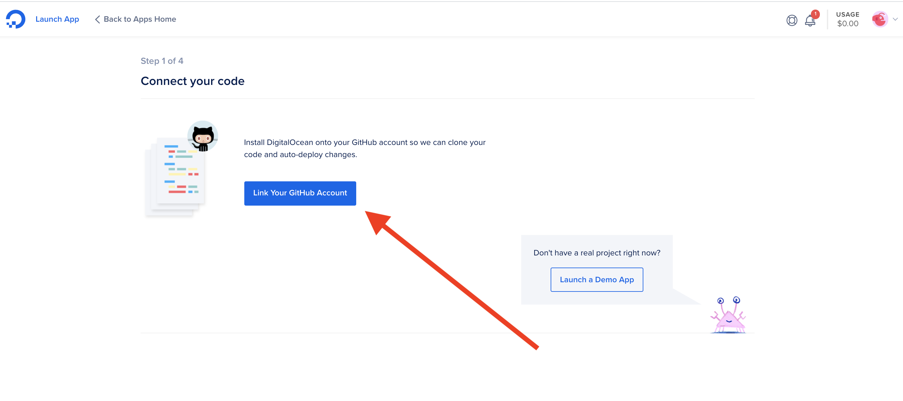
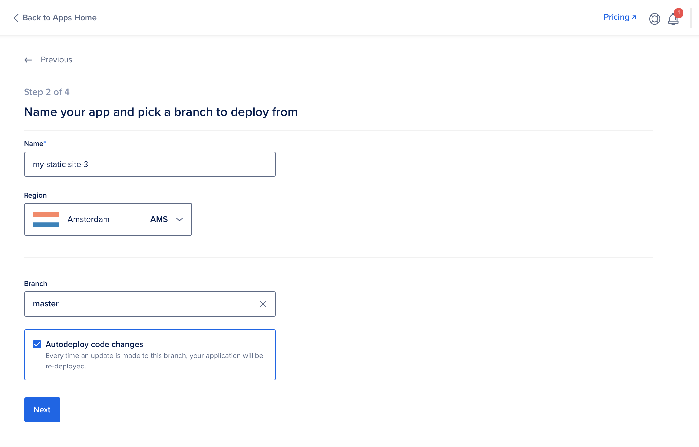
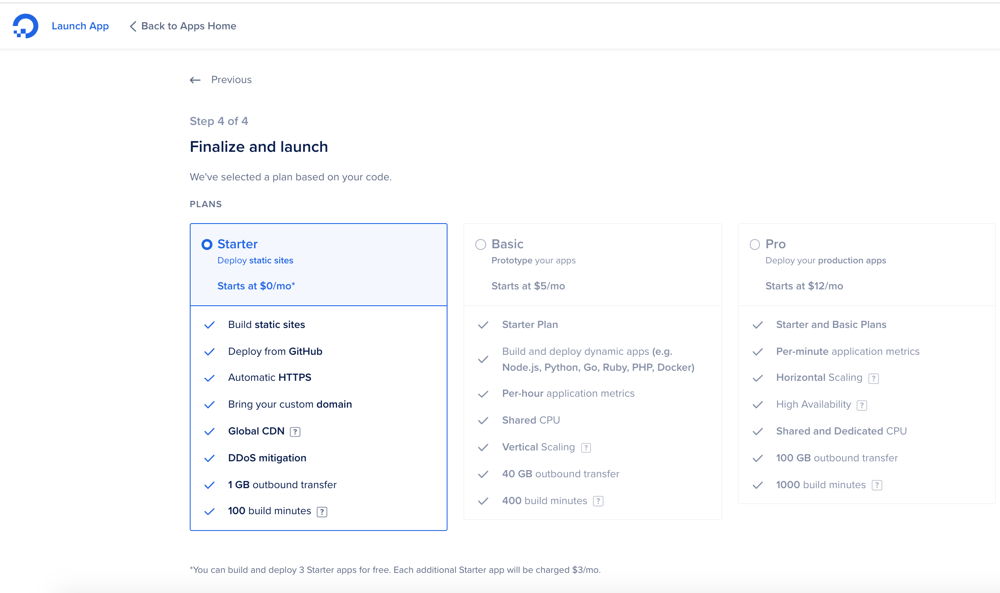

**Deploying App to DigitalOcean**  

## What is Digital Ocean?
[DigitalOcean](https://www.digitalocean.com/) is a cloud infrastructure provider.  
It offers cloud services to developers that help them in the deploying and scaling applications that run on multiple servers at the same time without reducing their performance. 

DigitalOcean offers related services, such as computing, storage, databases, and networking, through a developer-friendly interface optimized for high productivity. 

## What is a Static App?  

A [static app](https://accella.net/knowledgebase/advice/whats-the-difference-between-a-dynamic-and-a-static-mobile-app/) is any web application that can be delivered directly to an end user's browser without any server-side alteration of the HTML, CSS, or JavaScript content. 

Before deploying an app to DigitalOcean, setting up the GitHub environment is the initial important step  
Thus, 
The prerequisites include:
1. Static web application files
2. Email address (or [GitHub](https://github.com/) account)
3. Payment method (Credit Card or PayPal)  

# Steps to Deploying A Static Application to DigitalOcean  

Creating a local repository on your machine for static website project is a key step before deployment to DigitalOcean. 
The static website app's files are copied to the GitHub repository created. 
On the desktop, open the static website's 'working folder' - the one storing all the folders and files. 
Copy the files on the 'working folder' and paste them to the repository folder. 
After pasting the files on the local repository folder, save the changes to the repository. On GitHub, saved changes are called commits. 
Click 'Commit to master' to save your changes to the “main” branch of your project.
After a successful commit, push the committed files to GitHub and 'Publish Repository' 

Use the link below to check the published files in your GitHub.  

https://github.com/github_account_name/repository_name  
The link should direct you to a GitHub account with repository’s files. 
## Step 1
### *Create Your DigitalOcean Account*

To create a DigitalOcean account, you need to visit DigitalOcean's sign up page and choose among the following options: 

 

***Option 1:*** Manually enter your email address and password  
***Option 2:*** Google sign-in  
***Option 3:*** GitHub sign-in  

***Tip***
If you choose ***Option 1:*** (email address and password option), verification of the email is required.  
Check your email for a verification link automatically from Digital Ocean.  
Check spam in case you don't see the verification email in your inbox).  
Enter a payment method (Credit Card or PayPal) for identity verification (the payment method entered will not be charged).  

 

 

A pre-authorization charge to verify the credit card or PayPal account, which will be reversed within one week. 
After account verification, the App platform on Digital Ocean is now accessible. 

You will be billed on the first day of the following month for your current month’s usage, and your saved primary payment method will be automatically charged with your balance. 
In some cases, you might be charged if your usage exceeds a threshold. You can also log in and pay your current balance or make a pre-payment with PayPal at any time. 

## Step 2

### *Deploy Your Website with DigitalOcean App Platform*

In this step we’ll deploy our static website with App Platform.  

* Visit the DigitalOcean App Platform portal and click on the blue “Launch Your App” button. Check the image below. 
  

* You will be prompted to select your GitHub repository.
Here, link to connect your DigitalOcean App Platform account to your GitHub account by clicking *Link Your GitHub Account* button:

* Sign into your GitHub account and select the account that you want to connect to App Platform. 
Once selected, you will be directed to a page where you can select which repositories to permit App Platform to access.  
 

The page will prompt you to sign into GitHub and select the repositories to allow the DigitalOcean App Platform access. Select the *Only Repository* button and the select the created repository that was initially pushed to GitHub. 

* Click the *Save* button  
The page will redirect to App Platform that will enable selecting the repository in the dropdown menu:  

* After selecting your repository, click “Next.” 
You will then be prompted to choose the name, branch, and options for Autodeploy.  
If you check the *Autodeploy* box, all the future changes made to the repository files will automatically push to your live site. 
Choose the selections and click *Next*:  

 

* Static App Configuration. 
The page automatically detect your component type as a *Static Site*  
 

At the above step, there is no any necessary changes required. Click *Next* at the bottom of the page and the page will re-direct to a new window to allow the selection of a *Starter* use plan in case you prefer the deployment of the static website as among the first three sites allowed for free on DigitalOcean. 
 

After clicking the *Launch Your App* button, the DigitalOcean page will return a *Deployed Successfully* notification and the process will be complete.  

***Tip*** 
There will be links under the name of the static app, which should help in verifying the functionality of the app, which will also redirect to the published static app website. The site should appear, and if it does not, check any errors and try again.  

 You can host up to [three free static sites](https://docs.digitalocean.com/products/app-platform/#free-and-professional-tiers).  
 For further information check the DigitalOcean [App Documentation Page](https://docs.digitalocean.com/products/app-platform/) 
 To delete the staticx app, please follow the steps in [Destroy an App](https://docs.digitalocean.com/products/app-platform/quickstart/#destroy-an-app). 

